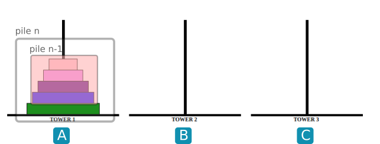
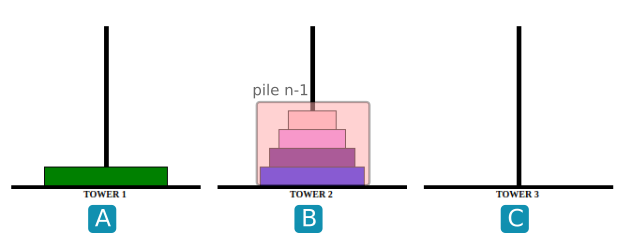
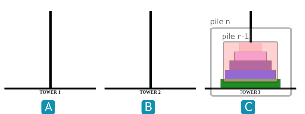
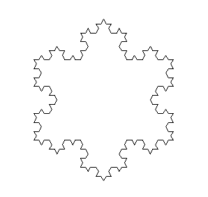
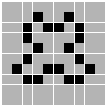

#Exercices

{{ initexo(0) }}


!!! example "{{ exercice() }}"
    === "Énoncé"
        Écrire une fonction récursive ```puissance(x, n)``` qui calcule le nombre $x^n$.
    === "Correction"
        {{ correction(True,
        "
        ```python linenums='1'
        def puissance(x, n):
            if n == 0:
                return 1
            else:
                return x * puissance(x, n-1)
        ```
        "
        ) }}


!!! example "{{ exercice() }} :heart: "
    === "Énoncé"
        On rappelle que le PGCD (plus grand diviseur commun de deux nombres) vérifie la propriété suivante : si la division euclidienne de $a$ par $b$ s'écrit $a = b \times q + r$, alors $pgcd(a,b)=pgcd(b,r)$. 

        Cette propriété est à la base de l'algorithme d'Euclide

        Exemple : $pgcd(24,18)=pgcd(18,6)=pgcd(6,0)$, donc $pgcd(24,18)=6$

        Écrire un algorithme récursif ```pgcd(a,b)```.
    === "Correction"
        {{ correction(True,
        "
        ```python linenums='1'
        def pgcd(a, b):
            if b == 0:
                return a
            else:
                return pgcd(b, a%b)
        ```
        "
        ) }}


!!! example "{{ exercice() }}"
    === "Énoncé"
        La conjecture de Syracuse (ou de Collatz) postule ceci :  

        *Prenons un nombre $n$ : si $n$ est pair, on le divise par 2, sinon on le multiplie par 3 puis on ajoute 1. On recommence cette opération tant que possible. Au bout d'un certain temps, on finira toujours par tomber sur le nombre 1.*

        1. Ecrire une fonction récursive ```syracuse(n)``` écrivant tous les termes de la suite de Syracuse, s'arrêtant (on l'espère) à la valeur 1.
        2. On appelle «temps de vol» le nombre d'étapes nécessaires avant de retomber sur 1. Modifier la fonction précédente afin qu'elle affiche le temps de vol pour tout nombre ```n```.

    === "Correction"
        {{ correction(True,
        "
        1.

        ```python linenums='1'
        def syracuse(n):
            print(n)
            if n == 1:
                return None
            if n % 2 == 0:
                return syracuse(n // 2)
            else:
                return syracuse(3*n + 1)
        ```

        Remarque : comme notre fonction ```syracuse``` ne renvoie pas de valeur numérique (elle ne fait qu'afficher une valeur), le ```return``` du test de parité est en fait inutile.

        Mais le ```return``` du cas de base est lui primordial pour que le code s'arrête !  

        ```python linenums='1'
        def syracuse(n):
            print(n)
            if n == 1:
                return None
            if n % 2 == 0:
                syracuse(n // 2)
            else:
                syracuse(3*n + 1)
        ```
        2.
        ```python linenums='1'
        def syracuse(n, t=0):
            print(n)
            t += 1
            if n == 1:
                print('temps de vol :', t)
                return None
            if n % 2 == 0:
                syracuse(n // 2, t)
            else:
                syracuse(3*n + 1, t)
        ``` 
        "
        ) }}        

!!! example "{{ exercice() }}"
    === "Énoncé"
        Reproduire le dessin suivant, à l'aide du module ```turtle```.  

        ```turtle``` est un hommage au langage LOGO inventé par [Seymour Papert](https://fr.wikipedia.org/wiki/Seymour_Papert) au MIT à la fin des années 60.

        {: .center width=40%}

        ```python linenums='1'
        from turtle import *
        def carre(c):
            for k in range(4):
                forward(c)
                right(90)
                
        carre(200)
        ```

    === "Correction"
        {{ correction(True,
        "
        ```python linenums='1'
        from turtle import *
        def carre(c):
            for k in range(4):
                forward(c)
                right(90)

        def base(c):
            carre(c)
            forward(c/2)
            right(45)

        def trace(c, n):
            if n == 0 :
                return None
            else :
                base(c)
                c = c/(2**0.5)
                return trace(c, n-1)
            
        trace(200, 5)
        ```
        "
        ) }}


!!! example "{{ exercice() }}"
    === "Énoncé"
        Proposer une nouvelle fonction récursive ```puissance_mod(x, n)``` qui calcule le nombre $x^n$. Pour optimiser la fonction déjà construite à l'exercice 1, utiliser le fait que :

        - si $n$ est pair, $a^n=(a \times a)^{n/2}$
        - sinon $a^n=a \times (a \times a)^{(n-1)/2}$

    === "Correction"
        {{ correction(True,
        "
        ```python linenums='1'
        def puissance_mod(x, n):
            if n == 0 :
                return 1
            else :
                if n % 2 == 0:
                    return puissance_mod(x*x, n//2)
                else :
                    return x*puissance_mod(x*x, (n-1)//2)
        ```
        "
        ) }}       

!!! example "{{ exercice() }}"
    === "Énoncé"
        Écrire un algorithme récursif ```recherche(lst, m)``` qui recherche la présence de la valeur ```m``` dans une liste **triée** (par ordre croissant) ```lst```. 
        
        Cette fonction doit renvoyer un booléen.

        _Aide :_
        
        Les techniques de *slicing* (hors-programme) permettent de couper une liste en deux : 
        ```python
        >>> lst = [10, 12, 15, 17, 18, 20, 22]
        >>> lst[:3]
        [10, 12, 15]
        >>> lst[3:]
        [17, 18, 20, 22]
        ``` 

    === "Correction"
        {{ correction(False,
        "
        ```python linenums='1'
        def recherche(lst, m):
            print(lst) # pour voir la taille de la liste diminuer
            if len(lst) == 1:  #cas de base
                if lst[0] == m:
                    return True
                else:
                    return False
            else :              #cas récursif
                mid = len(lst)//2
                if lst[mid] > m:
                    return recherche(lst[:mid],m)
                else:
                    return recherche(lst[mid:],m)
        ```
        "
        ) }}       
        

!!! example "{{ exercice() }}"
    === "Énoncé"
        On considère le jeu des **Tours de Hanoï**.
        Le but est de faire passer toutes les assiettes de A vers C, sachant qu'une assiette ne peut être déposée que sur une assiette de diamètre inférieur.
        {: .center width=60%}

        Une version jouable en ligne peut être trouvée [ici](https://www.mathsisfun.com/games/towerofhanoi.html).

        1. S'entraîner et essayer d'établir une stratégie de victoire.
        2. Observer les images ci-dessous :
        {: .center width=60%}
        {: .center width=60%}
        {: .center width=60%}
        {: .center width=60%}


        Écrire une fonction récursive ```hanoi(n, A, B, C)``` qui donnera la suite d'instructions (sous la forme " A vers C") pour faire passer une pile de taille n de A vers C en prenant B comme intermédiaire.

    === "Correction"
        {#   
        ```python linenums='1'
        def hanoi(n, depart, inter, arrivee):
            """ n : nombre d'assiettes dans la pile
            # depart : la pile de départ("A", "B" ou "C")
            # inter : la pile intermédaire("A", "B" ou "C")
            # arrivee : la pile d'arrivée ("A", "B" ou "C") """

            if n == 1 :
                print(depart + " vers " + arrivee)
            else :
                hanoi(n-1, depart, arrivee, inter) 
                print(depart + " vers " + arrivee)
                hanoi(n-1, inter, depart, arrivee)

        hanoi(5, "A", "B", "C")
        ```#}
      


!!! example "{{ exercice() }}"
    === "Énoncé"
        Cet exercice a pour objectif le tracé du flocon de Von Koch.
        {: .center width=60%}


        L'idée est de répéter de manière récursive la transformation ci-dessous : chaque segment de longueur ```l``` donne naissance à 4 segments de longueur ```l/3```, en construisant une pointe de triangle équilatéral sur le deuxième tiers du segment.

        {: .center width=60%}


        1) Créer une fonction récursive ```floc(n, l)``` qui trace à une «profondeur» ```n``` un segment de longueur ```l```.
        {: .center width=60%}
        **Indications**

        - l'instruction de tracé n'a lieu que quand ```n``` vaut 0.
        - l'étape ```n``` fait 4 appels sucessifs à l'étape ```n-1```.

        2) Créer une fonction ```triangle(n, l)``` qui trace le flocon complet.

    === "Correction"
        {#       
        ```python linenums='1'
        from turtle import *

        def floc(n, l):
            if n == 0:
                forward(l)
            else:
                floc(n-1,l/3)
                left(60)
                floc(n-1,l/3)
                right(120)
                floc(n-1,l/3)
                left(60)
                floc(n-1,l/3)
                

        speed(0)

        def triangle(n,l):
            for _ in range(3):
                floc(n,l)
                right(120)
                
        triangle(5,400)

        ``` #}


!!! example "{{ exercice() }}"
    === "Énoncé"
        Exercice de diffusion récursive sur Capytale

        {: .center}
        
    === "Correction"
        {#
        ```python linenums='1'
        def propager(grid, i, j, color):
            if grid[i,j].green == 0:
                return None # 

            grid[i,j].green = color

            # l'élément en haut fait partie de la composante
            if ((i-1) >= 0 and grid[i-1,j].green == 180):
                propager(grid, i-1, j, color)

            # l'élément en bas fait partie de la composante
            if ((i+1) < n and grid[i+1,j].green == 180):
                propager(grid, i+1, j, color)

            # l'élément à gauche fait partie de la composante
            if ((j-1) >= 0 and grid[i,j-1].green == 180):
                propager(grid, i, j-1, color)

            # l'élément à droite fait partie de la composante
            if ((j+1) < n and grid[i,j+1].green == 180): # 
                propager(grid, i, j+1, color)


        grid = initgrid()
        propager(grid,0,3,0)
        grid.show()
        ```
        #}


## Exercice 
Exercice 4 du sujet [Amérique du Nord J1](https://raoulhatterer.github.io/tnsi/T6_Annales/data/2022/2022_Amerique_Nord_J1.pdf){. target="_blank"}

??? tip "correction Q1.a."
    Proposition 3

??? tip "correction Q1.b."
    ```txt[0]``` vaut 'b'  
    ```txt[taille-1]``` vaut 'r'  
    ```interieur``` vaut 'onjou'  


??? tip "correction Q2."
    ```python linenums='1'
    def test_palindrome():
        assert palindrome("kayak") == True
        assert palindrome("canoe") == False   
    ```
    On teste les deux cas possibles.

??? tip "correction Q3."
    ```python linenums='1'
    def palindrome_imperatif(txt):
        if len(txt) < 2:
            return True
        i = 0
        j = len(txt)-1
        while i<j:
            if txt[i] != txt[j]:
                return False
            i += 1
            j -= 1
        return True
    ```

??? tip "correction Q4.a."
    ```python linenums='1'
    def complementaire(txt):
        comp = {"A":"T", "T":"A", "G":"C", "C":"G"}
        sol = ""
        for c in txt:
            sol += comp[c]
        return sol
    ``` 

??? tip "correction Q4.b"
    "GATCGTCTAGCA" n'est pas un palindrome donc "GATCGT" n'est pas palindromique.

??? tip "correction Q4.c"
    ```python linenums='1'
    def est_palindromique(txt):
        txt_total = txt + complementaire(txt)
        return palindrome(txt_total)
    ```


??? info "Bibliographie"
    - Numérique et Sciences Informatiques, Terminale, T. BALABONSKI, S. CONCHON, J.-C. FILLIATRE, K. NGUYEN, éditions ELLIPSES.
    - Prépabac NSI, Terminale, G.CONNAN, V.PETROV, G.ROZSAVOLGYI, L.SIGNAC, éditions HATIER.


{#
<!-- - [lien](data/DS02.pdf) vers le DS
- [lien](data/DS02_correction.pdf) vers sa correction -->

#}
