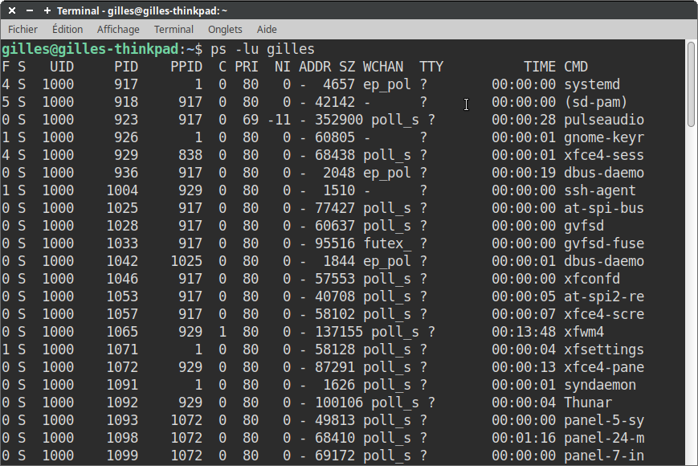
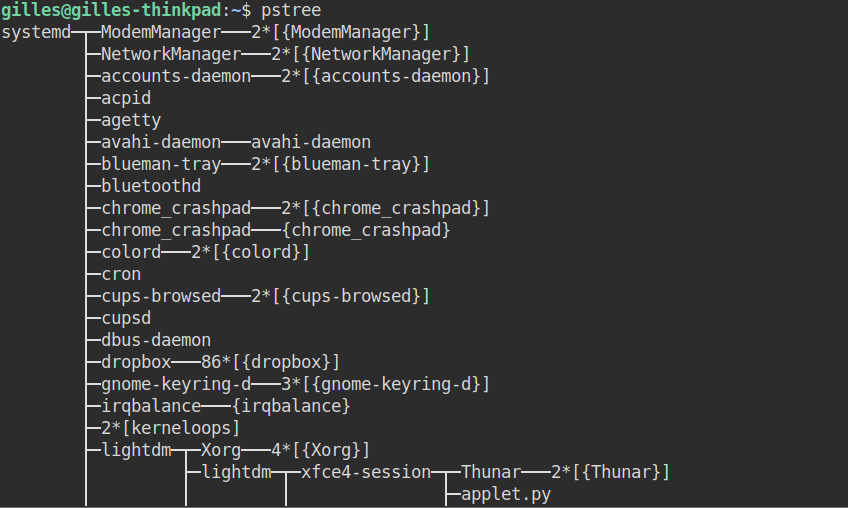
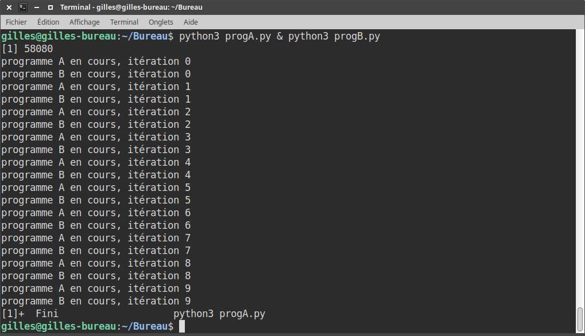
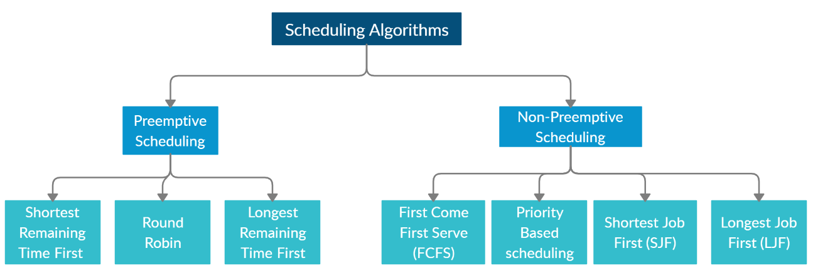
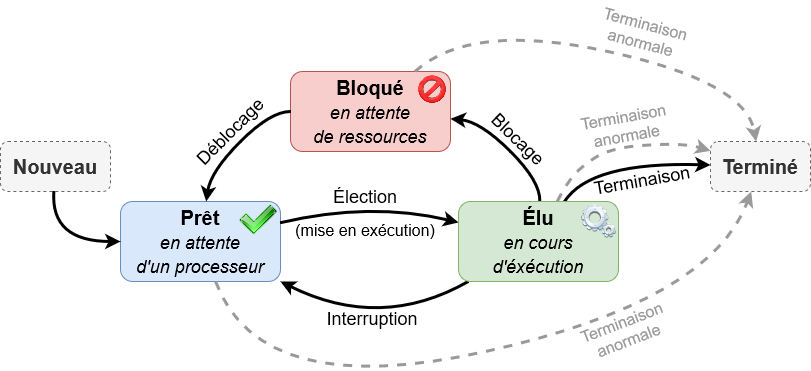
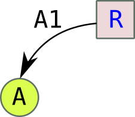

# Gestion des processus

{: .center}

{: .center width=40%}

## 1. Notion de processus

### 1.1 Définition d'un processus

Lorsqu'un programme est exécuté sur un ordinateur, celui-ci va créer un (ou plusieurs) **processus**.

On dit que ce processus est une **instance d'exécution** de ce programme.

Un processus est caractérisé par :

- l'ensemble des instructions qu'il va devoir accomplir (écrites dans le fichier exécutable obtenu par la compilation du code-source du programme)
- les ressources que le programme va mobiliser (fichier en ouverture, carte son...)
- l'état des registres du processeur (voir le cours de Première sur l'[architecture Von Neumann](https://lyceemed.forge.aeif.fr/pnsi/T3_Architecture_materielle/Chapitre_2:_Architecture_Von_Neumann/cours/){. target="_blank"})


### 1.2 Observation des processus sous Linux

### 1.2.1 La commande ```ps``` 

Dans un terminal, la commande ```ps``` va permettre d'afficher la liste des processus actifs. 

> Plus précisément, nous allons utiliser la commande ```ps -lu nom_user```. L'option ```l``` permet d'afficher un grand nombre de renseignements et l'option ```u``` permet de spécifier l'utilisateur propriétaire des processus.

{: .center}

On retrouve notamment dans ce tableau les colonnes :

- ```CMD```  (Command) : le nom de la commande qui a créé le processus. Vous pouvez y retrouver par ordre chronologique le nom de tous les programmes actifs. Certains sont ceux que vous avez ouverts volontairement (navigateur...) mais on y trouve surtout tous les programmes nécessaires au bon fonctionnement du système d'exploitation. Le dernier processus en bas de la liste est forcément ```ps```, puisque vous venez de l'appeler.

- ```PID``` (Process Identifier) : le numéro unique d'identification, affecté chronologiquement par le système d'exploitation. Le processus de PID égal à 1 est ```systemd```, qui est le [tout premier programme](https://doc.ubuntu-fr.org/systemd){. target="_blank"} lancé par le noyau Linux au démarrage. 

- ```PPID``` (Parent PID) : certains processus vont *eux-mêmes* lancer plusieurs processus-fils, qui porteront le même nom. C'est ainsi qu'on peut retrouver de multiples processus s'appelant ```chrome``` :

{: .center}

Ici, l'instance «principale» de Chrome (```PID``` 1453) a généré 6 autres instances de ```PID``` différents, dont le ```PPID``` vaut 1453.

> Dans Chrome/Chromium, vous pouvez comprendre le rôle de chaque processus en le retrouvant dans le gestionnaire des tâches (clic-droit sur une zone vide de la barre d'onglets)

### 1.2.2 La commande ```pstree``` 

À noter que la commande ```pstree``` permet d'afficher les processus sous forme d'arborescence : 

{: .center}

### 1.2.3 La commande ```top``` 

La commande ```top``` permet de connaître en temps réel la liste des processus, classés par ordre décroissant de consommation de CPU. 

On ferme ```top``` par la combinaison de touches ```Ctrl-C```.


!!! info "Pourcentage d'utilisation du CPU"
    En face de chaque processus est affichée sa consommation de CPU. Elle est calculée en prenant, sur un intervalle de temps donné, le temps qu'a passé le CPU à traiter le processus en question, et en divisant ce temps par le temps total de la mesure. 

    $$\text{Pourcentage d'utilisation CPU} = \frac{\text{Temps d'utilisation CPU}}{\text{Temps total écoulé}} \times 100$$

Si on repère alors un processus qui consomme beaucoup trop de ressources, on peut utiliser...

### 1.2.4 La commande ```kill``` 
La commande ```kill``` permet de fermer un processus, en donnant son ```PID```  en argument.

Exemple : ```kill 1453``` tuera Chrome (voir la capture du 1.2.1)


{: .center width=50%}


## 2. Ordonnancement

### 2.1 Expérience : les processus fonctionnent ~~simultanément~~ à tour de rôle.  
Un ordinateur donne l'illusion de réaliser plusieurs tâches simultanément. Hormis pour les processeurs fonctionnant avec plusieurs cœurs, il n'en est rien.


Comme nous l'avons vu, ces processus sont lancés séquentiellement par le système d'exploitation, et sont ensuite en apparence tous «actifs en même temps» (les guillemets sont importants) : on parle de **programmation concurrente**.

Revenons sur l'expression «actifs en même temps», car elle véhicule une fausse idée : ces processus sont bien vivants dans un même laps de temps, mais ils s'exécutent **LES UNS APRÈS LES AUTRES**, le processeur ne pouvant en traiter qu'**un seul à la fois**.

Un cadencement extrêmement rapide et efficace donne l'*apparence* d'une (fausse) simultanéité. Nous allons la mettre en évidence :

Considérons les fichiers ```progA.py``` et ```progB.py``` ci-dessous :

```python title="progA.py"
import time

for i in range(10):
    print("programme A en cours, itération", i)
    time.sleep(0.02)  
```

```python title="progB.py"
import time
time.sleep(0.01)
for i in range(10):
    print("programme B en cours, itération", i)
    time.sleep(0.02)  
```

Le programme ```progB.py``` est légèrement retardé au démarrage par le ```time.sleep(0.01)```.
Il devrait donc en résulter un entrelacement entre les phrases ```programme A en cours``` et ```programme B en cours```.  

L'exécution «d'apparence simultanée» de ces deux programmes peut se faire dans un Terminal via la commande ```python3 progA.py & python3 progB.py```.

Il en résulte ceci :

{: .center}

Nous retrouvons bien l'alternance prévue à la lecture du code.  
Tout se passe donc comme si les deux processus avaient été lancés et traités simultanément.

Réduisons maintenant les temporisations (en passant du centième de seconde à la milliseconde): 

```python title="progA.py"
import time

for i in range(10):
    print("programme A en cours, itération", i)
    time.sleep(0.002)  
```

```python title="progB.py"
import time
time.sleep(0.001)
for i in range(10):
    print("programme B en cours, itération", i)
    time.sleep(0.002)  
```

Il en résulte maintenant ceci :

{: .center}

L'alternance prévue n'est plus respectée (et les résultats deviennent non-reproductibles).

Si la gestion des processus était réellement simultanée, même en considérant des ralentissements du processeur par des sollicitations extérieures, chaque processus serait ralenti de la même manière : l'entrelacement des phrases serait toujours le même. 

En réalité, le processeur passe son temps à alterner entre les divers processus qu'il a à gérer, et les met en attente quand il ne peut pas s'occuper d'eux. Il obéit pour cela aux instructions de son **ordonnanceur**.


## 2.2 L'ordonnancement des processus

### 2.2.1 Différents types d'ordonnancement

Si on vous donne 4 tâches A, B, C et D à accomplir, vous pouvez décider :

- de faire la tâche prioritaire d'abord ;
- de faire la tâche la plus rapide d'abord ;
- de faire la tâche la plus longue d'abord ;
- de les faire dans l'ordre où elles vous ont été données ;
- de faire à tour de rôle chaque tâche pendant un temps fixe jusqu'à ce qu'elles soient toutes terminées;
- ...

Un processeur est confronté aux mêmes choix : comment déterminer quel processus doit être traité à quel moment ?

Le schéma ci-dessous (issu de [ce site](https://medium.com/@sheenam.mca17.du/process-scheduling-b86975413079){. target="_blank"}) présente quelques politiques d'ordonnancement :

{: .center width=80%}

Sous Linux, l'ordonnancement est effectué par un système hybride où les processus sont exécutés à tour de rôle (on parle de *tourniquet* ou de *Round Robin*) suivant un ordre de priorité dynamique.

> Dans le cas (très fréquent maintenant) d'un processeur *multi-cœurs*, le problème reste identique. Certes, sur 4 cœurs, 4 processus pourront être traités simultanément (une **réelle** simultanéité) mais il reste toujours beaucoup plus de processus à traiter que de cœurs dans le processeur... et un ordonnancement est donc toujours nécessaire.


### 2.2.2 Les différents états d'un processus

Selon que l'ordonnanceur aura décidé de le confier ou non au processeur pour son exécution, un processus peut donc se trouver dans 3 états :

- **Prêt** : il attend qu'arrive le moment de son exécution.
- **Élu** : il est en cours d'exécution par le processeur.
- **Bloqué** : pendant son exécution (état **Élu**), le processus réclame une ressource qui n'est pas immédiatement disponible. Son exécution s'interrompt. Lorsque la ressource sera disponible, le processus repassera par l'état **Prêt** et attendra à nouveau son tour. 

Voici les transitions possibles entre ces états (diagramme issu de [https://info.blaisepascal.fr/nsi-processus-et-ressources](https://info.blaisepascal.fr/nsi-processus-et-ressources){. target="_blank"}) : 


{: .center}


Ou de manière simplifiée :

{: .center}


On peut utiliser la métaphore suivante :

Sur le bureau d'un professeur, il y a 3 paquets de copies, correspondant aux classes A, B, et C. Ces paquets sont **Prêts** à être corrigés.

- Si le professeur ramène devant lui le paquet A, celui-ci devient **Élu**, et le professeur peut commencer à le corriger.
- Pour se changer les idées, il peut interrompre la correction du paquet A (qui repassera à l'état **Prêt** en attendant son tour) et ramener vers lui le paquet C. Il pourra ensuite prendre le paquet B, puis à nouveau le C, puis le A, ainsi de suite jusqu'à ce que tous les paquets soient totalement corrigés. Ces paquets seront alors **Terminés**. 
- Si, pendant la correction du paquet, le professeur donne celui-ci à sa fille pour qu'elle classe les copies par ordre alphabétique, ce paquet sera **Bloqué**. Il ne reviendra à l'état **Prêt** que quand la fille du professeur aura rendu le paquet.

Au cours de cette procédure, le professeur n'a toujours eu devant lui qu'**un seul paquet de copies** (soit A, soit B, soit C).


**Pourquoi l'accès à une ressource peut bloquer un processus ?**

Pendant son exécution, un processus peut avoir besoin d'accéder à une ressource déjà occupée (un fichier déjà ouvert, par exemple) ou être en attente d'une entrée-utilisateur (un ```input()``` dans un code ```Python``` par exemple). Dans ce cas-là, le processeur va passer ce processus à l'état **Bloqué**, pour pouvoir ainsi se consacrer à un autre processus.

Une fois débloqué, le processus va repasser à l'état **Prêt** et rejoindre (par exemple) la file d'attente des processus avant d'être à nouveau **Élu** et donc exécuté.


## 3. Interblocage

### 3.1 Définition et exemple
Comme nous venons de le voir, un processus peut être dans l'état bloqué dans l'attente de la libération d'une ressource. 

Ces ressources (l'accès en écriture à un fichier, à un registre de la mémoire...) ne peuvent être données à deux processus à la fois. Des processus souhaitant accéder à cette ressource sont donc en concurrence sur cette ressource. Un processus peut donc devoir attendre qu'une ressource se libère avant de pouvoir y accéder (et ainsi passer de l'état Bloqué à l'état Prêt).

**Problème :** Et si deux processus se bloquent mutuellement la ressource dont ils ont besoin ?

**Exemple :** Considérons 2 processus A et B, et deux ressources R et S. L'action des processus A et B est décrite ci-dessous :

{: .center}

**Déroulement des processus A et B :**

- A et B sont créés et passent à l'état **Prêt**.
- L'ordonnanceur déclare **Élu** le processus A (ou bien B, cela ne change rien).
- L'étape A1 de A est réalisée : la ressource R est donc affectée à A.
- L'ordonnanceur déclare maintenant **Élu** le processus B. A est donc passé à **Prêt** en attendant que son tour revienne.
- L'étape B1 de B est réalisée : la ressource S est donc affectée à B.
- L'ordonnanceur déclare à nouveau **Élu** le processus A. B est donc passé à **Prêt** en attendant que son tour revienne.
- L'étape A2 de A est donc enclenchée : problème, il faut pour cela pouvoir accèder à la ressource S, qui n'est pas disponible. L'ordonnanceur va donc passer A à **Bloqué** et va revenir au processus B qui redevient **Élu**.
- L'étape B2 de B est donc enclenchée : problème, il faut pour cela pouvoir accèder à la ressource R, qui n'est pas disponible. L'ordonnanceur va donc passer B à **Bloqué**.

Les deux processus A et B sont donc dans l'état **Bloqué**, chacun en attente de la libération d'une ressource bloquée par l'autre : ils se bloquent mutuellement.

Cette situation (critique) est appelée **interblocage** ou **deadlock**.

### 3.3 Représentation schématique

- les processus seront représentés par des **cercles**, les ressources par des **carrés**.
- Si à l'étape A1 le processus A a demandé et **reçu** la ressource R, la représentation sera :
{: .center}
- Si à l'étape A2 le processus A est **en attente** de la ressource S, la représentation sera :
{: .center}

Avec ces conventions, la situation précédente peut donc se schématiser par :

{: .center}

Ce type de schéma fait apparaître un **cycle d'interdépendance**, qui caractérise ici la situation de deadlock.

### 3.4 Comment s'en prémunir ? *(HP)*

Il existe trois stratégies pour éviter les interblocages :

- **la prévention** : on oblige le processus à déclarer à l'avance la liste de toutes les ressources auxquelles il va accéder.
- **l'évitement** : on fait en sorte qu'à chaque étape il reste une possibilité d'attribution de ressources qui évite le deadlock.
- **la détection/résolution** : on laisse la situation arriver jusqu'au deadlock, puis un algorithme de résolution détermine quelle ressource libérer pour mettre fin à l'interblocage.


### 3.5 Le deadlock dans la vie courante

#### 3.5.1 L'emballage diabolique
{: .center width=30%}

#### 3.5.2 Le carrefour maudit
{: .center width=40%}

#### 3.5.3 Le chômage éternel
{: .center width=30%}


