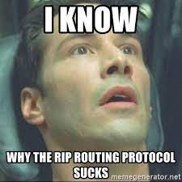
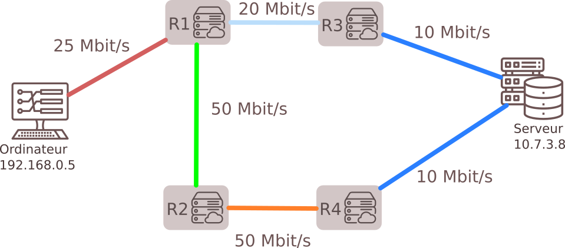
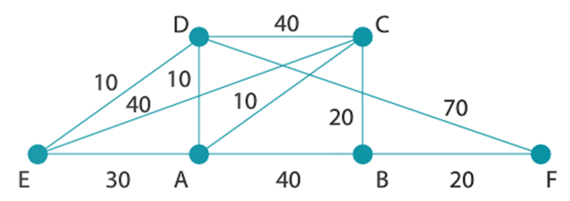
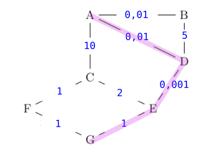
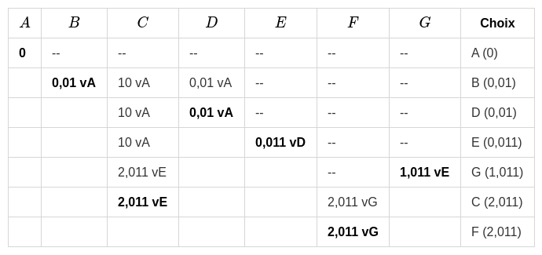

# Protocoles de routage

{: .center}

{: .center}


## 0. Résumé des épisodes précédents

- [cours](https://lyceemed.forge.aeif.fr/pnsi/T3_Architecture_materielle/Chapitre_3:_Architecture_reseau/cours/){:target="_blank"} de 1ère sur l'architecture d'un réseau
- [cours](https://lyceemed.forge.aeif.fr/pnsi/T3_Architecture_materielle/Chapitre_4:_Protocoles_de_communication/cours/){:target="_blank"} de 1ère sur les différents protocoles de communication dans un réseau.


!!! abstract "Notions essentielles :heart: :heart: :heart:"
    Lorsqu'une machine A, d'adresse IP_A veut discuter avec une machine B, d'adresse IP_B :

    - La machine A calcule (grâce au masque de sous-réseau) si B est dans le même sous-réseau qu'elle, ou pas.
    - Si oui, elle peut donc connaître l'adresse MAC de la carte réseau de la machine B (soit elle la possède déjà dans sa table ARP, soit elle la demande en envoyant un message de broadcast à tout le sous-réseau : «qui possède cette adresse IP_B ?»).
    Elle envoie donc dans le sous-réseau une trame ayant pour entête l'adresse MAC de B : le switch lit cette trame, sait sur quel port est branché la machine B et lui envoie spécifiquement donc le message.
    - Si B n'est pas dans le même sous-réseau que A, A mettra en entête de sa trame l'adresse MAC de la carte réseau du routeur, qui joue le rôle de passerelle. Le routeur va ouvrir la trame et va observer l'IP_B, à qui il doit remettre ce message. C'est maintenant que vont intervenir les protocoles de routage :
        - est-ce que B est dans le même sous-réseau que le routeur ?
        - est-ce que B est dans un autre sous-réseau connu du routeur ?
        - est-ce que B est totalement inconnu du routeur ?


    Ces questions trouveront des réponses grâce à **table de routage** du routeur.

## 1. Tables de routage

{: .center}


Les tables de routage sont des informations stockées dans le routeur permettant d'aiguiller intelligemment les données qui lui sont transmises.

Dans le réseau ci-dessus, si l'ordinateur d'adresse ```192.168.0.5``` veut interroger le serveur ```10.7.3.8``` :

- l'adresse ```10.7.3.8``` n'étant pas dans le sous-réseau F (d'adresse ```192.168.0.0 / 24```), la requête est confiée au routeur via son adresse passerelle dans le réseau F (ici ```192.168.0.254```).
- le routeur observe si l'IP recherchée appartient à un autre des sous-réseaux auquel il est connecté. Ici, l'IP recherchée ```10.7.3.8``` n'appartient ni au sous-réseau A ou E. 
- le routeur va donc regarder dans sa table de routage l'adresse passerelle d'un autre routeur vers qui elle doit rediriger les données. Si le sous-réseau C fait partie de sa table de routage, le routeur R1 saura alors que le meilleur chemin est (par exemple) de confier les données au routeur R3.
- si le sous-réseau C ne fait pas partie de la table de routage, le routeur R1 va alors le rediriger vers une route «par défaut» (que l'on peut assimiler au panneau «toutes directions» sur les panneaux de signalisation).

!!! note "interface et passerelle :heart: :heart: :heart:"
    Les tables de routage des routeurs font très souvent apparaître deux colonnes, _interface_ et _passerelle_, dont il ne faut pas confondre l'utilité :

    - **interface** : c'est l'adresse IP de la carte réseau du routeur par où va **sortir** le paquet à envoyer. Il y a donc **toujours** une adresse d'interface à renseigner (car un paquet sort bien de quelque part !). Parfois cette interface sera juste nommée _interface1_ ou _interface2_.

    - **passerelle** : c'est l'adresse IP de la carte réseau du routeur **à qui on va confier le paquet**, si on n'est pas capable de le délivrer directement (donc si l'adresse IP de destination n'est pas dans notre propre sous-réseau). Cette adresse de passerelle n'est donc pas _systématiquement_ mentionnée. Quand elle l'est, elle donne le renseignement sur le prochain routeur à qui le paquet est confié.


**Exemple: table de routage du routeur R1**

{: .center width=70%}

| Destination | Interface | Passerelle |
|:-:|-|-|
| F | 192.168.0.254 | | 
| A | 10.0.5.152 | |
| E | 172.17.1.254 | |  
| B | 172.17.1.254 |172.17.1.123| 
| C | 10.0.5.152 |10.0.5.135| 

Les trois réseaux F, A et E sont directement accessibles au routeur R1, puisqu'il en fait partie : il n'a donc pas besoin d'adresse passerelle pour communiquer avec ces réseaux.

Par contre, la communication avec le réseau B nécessite de confier le paquet au routeur R2 (c'est le choix de cette table de routage). Il faut donc mentionner l'adresse IP de ce routeur R2 (172.17.1.123), qu'on appelle adresse de passerelle.

De la même manière, la communication avec le réseau C nécessite de confier le paquet au routeur R3 (c'est le choix de cette table de routage). Il faut donc mentionner l'adresse IP de ce routeur R3 (10.0.5.135).


#### Comment sont construites les tables de routage ?
- Soit à la main par l'administrateur réseau, quand le réseau est petit : on parle alors de table **statique**.
- Soit de manière **dynamique** : les réseaux s'envoient eux-mêmes des informations permettant de mettre à jour leurs tables de routages respectives. Des algorithmes de détermination de meilleur chemin sont alors utilisés : nous allons en découvrir deux, le protocole `RIP` et le protocole `OSPF`.

## 2. Le protocole RIP


Le protocole `RIP` (**R**outing **I**nformation **P**rotocol) est un protocole de routage qui
minimise le nombre de routeurs par lesquels les paquets transitent.

!!! abstract "principe fondamental du protocole RIP :heart:"
    Le chemin le plus court.


_voir le TP débranché_ : [le jeu dont vous êtes le routeur](https://www.overleaf.com/read/ppcyddjmkgjp#aaf7e4){. target="_blank"}


!!! abstract "Les règles du protocole RIP :heart: :heart: :heart:"
    Le Routing Information Protocol (`RIP`) est basé sur l'échange (toutes les 30 secondes) des tables de routage de chaque routeur.  
    Au début, chaque routeur ne connaît que les réseaux auquel il est directement connecté, associé à la distance 1.  
    Ensuite, chaque routeur va recevoir périodiquement (toutes les 30 secondes) la table des réseaux auquel il est connecté, et mettre à jour sa propre table suivant les règles ci-dessous :

    - s'il découvre une route vers un nouveau réseau inconnu, il l'ajoute à sa table en augmentant de 1 la distance annoncée par le routeur qui lui a transmis sa table.

    - s'il découvre une route vers un réseau connu mais plus courte (en rajoutant 1) que celle qu'il possède dans sa table,  il actualise sa table.

    - s'il découvre une route vers un réseau connu mais plus longue que celle qu'il possède dans sa table, il ignore cette route.

    - s'il reçoit une route vers un réseau connu en provenance d'un routeur déjà existant dans sa table, il met à jour sa table car la topologie du réseau a été modifiée.

    - si le réseau n'évolue pas (panne ou ajout de nouveau matériel), les tables de routage _convergent_ vers une valeur stable. Elles n'évoluent plus.

    - si un routeur ne reçoit pas pendant 3 minutes d'information de la part d'un routeur qui lui avait auparavant communiqué sa table de routage, ce routeur est considéré comme en panne, et toutes les routes passant par lui sont affectées de la distance infinie : 16.

**Remarques et inconvénients:** 

- Le protocole `RIP` n'admet qu'une distance maximale égale à 15 (ceci explique que 16 soit considéré comme la distance infinie), ce qui le limite aux réseaux de petite taille.

- Chaque routeur n'a jamais connaissance de la topologie du réseau tout entier : il ne le connaît que par ce que les autres routeurs lui ont raconté. On dit que ce protocole de routage est du _routing by rumor_.

- La _métrique_ utilisée (le nombre de sauts) ne tient pas compte de la qualité de la liaison, contrairement au protocole `OSPF`.    


## 3. Le protocole OSPF

Un inconvénient majeur du protocole précédent est la non-prise en compte de la bande passante reliant les routeurs.

{: .center width=30%}

Le protocole `OSPF` (**O**pen **S**hortest **P**ath **F**irst) est un protocole de routage qui
minimise le coût du transit des paquets.

!!! abstract "principe fondamental du protocole OSPF :heart:"
    Le chemin le plus rapide n'est pas forcément le plus court.

{: .center width=40%}

<div>
<center>
<i>
En gris, le chemin RIP. En bleu, l'OSPF.
</i>
</center>
</div>

Dans le protocole `OSPF`, les tables de routage vont prendre en considération la **vitesse de communication** entre les routeurs.

Dans une première phase d'initialisation, chaque routeur va acquérir (par succession de messages envoyés et reçus) la connaissance **totale** du réseau (différence fondamentale avec `RIP`) et de la qualité technique de la liaison entre chaque routeur.

#### 3.1 Les différents types de liaison et leur coût
On peut, approximativement, classer les types de liaison suivant ce tableau de débits **théoriques** :


| Technologie | BP descendante | BP montante |
|-|-|-|
| Modem | 56 kbit/s | 48 kbit/s |
| Bluetooth | 3 Mbit/s | 3 Mbit/s |
| Ethernet | 10 Mbit/s | 10 Mbit/s |
| Wi-Fi |  10 Mbit/s ~ 10 Gbits/s | 10 Mbit/s ~ 10 Gbits/s |
| ADSL | 13 Mbit/s | 1 Mbit/s |
| 4G | 100 Mbit/s | 50 Mbit/s |
| Satellite | 50 Mbit/s | 1 Mbit/s |
| Fast Ethernet | 100 Mbit/s | 100 Mbit/s |
| FFTH (fibre) | 10 Gbit/s | 10 Gbit/s |
| 5G | 20 Gbit/s | 10 Gbit/s |


L'idée du protocole `OSPF` est de pondérer chaque trajet entre routeurs (comptant simplement pour «1» dans le protocole `RIP`) par une valeur de **coût** inversement proportionnelle au débit de transfert.

Par exemple, si le débit $d$ est exprimé en bits/s, on peut calculer le coût de chaque liaison par la formule :

$$ \text{coût} = \frac{10^8}{d} $$


Cette formule de calcul peut être différente suivant les exercices, et sera systématiquement redonnée. Néanmoins la valeur $d$ sera toujours au dénominateur, pour assurer la proportionnalité inverse du débit.


Avec cette convention, un route entre deux routeurs reliés en Fast Ethernet (100 Mbits/s) aura a un poids de 1, une liaison satellite de 20 Mbits/s aura un poids de 5, etc.

### 3.2 Exemple

Reprenons le réseau suivant :

{: .center  width=60%}


et simplifions-le en ne gardant que les liens entre routeurs, en indiquant leur débit :


{: .center width=60%}


Notre réseau est devenu un **graphe**. 

Nous allons pondérer ses arêtes avec la fonction coût introduite précédemment. L'unité étant le Mbit/s, l'arête entre R1 et R3 aura un poids de $\frac{100}{20}=5$.

Le graphe pondéré est donc :


{: .center width=60%}


Le chemin le plus rapide pour aller de l'ordinateur au serveur est donc R1-R2-R4, et non plus R1-R3 comme l'aurait indiqué le protocole `RIP`.

### 3.3 Trouver le plus court chemin dans un graphe pondéré
L'exemple précédent était très simple et de solution intuitive. Dans le cas d'un graphe pondéré complexe, existe-t-il un algorithme de détermination du plus court chemin d'un point à un autre ?

La réponse est **oui**, depuis la découverte en 1959 par Edsger Dijkstra de l'algorithme qui porte son nom, **l'algorithme de Dijkstra**.

Pour le comprendre, vous pouvez regarder la vidéo d'un célèbre YouTuber :

<p align="center">
<iframe width="790" height="372" src="https://www.youtube.com/embed/rI-Rc7eF4iw" title="YouTube video player" frameborder="0" allow="accelerometer; autoplay; clipboard-write; encrypted-media; gyroscope; picture-in-picture" allowfullscreen></iframe>
</p>

Cet algorithme, ici exécuté de manière manuelle, est bien sûr programmable. Et c'est donc grâce à lui que chaque routeur calcule la route la plus rapide pour acheminer les données qu'il reçoit.

!!! abstract "Exercice d'application de l'algorithme de Dijkstra (HP)"
    
    Donner le plus court chemin pour aller de E à F dans le graphe ci-dessous :
    {: .center width=60%}

    ??? tip "correction"
        |E|A|B|C|D|F|Choix|
        |:-:|:-:|:-:|:-:|:-:|:-:|:-:|
        |**0**|--|--|--|--|--|E(0)|
        |.|30vE|--|40vE|**10vE**|--|D(10)|       
        |.|**20vD**|--|40vE|.|80vD|A(20)|
        |.|.|60vA|**30vA**|.|80vD|C(30)|
        |.|.|**50vC**|.|.|80vD|B(50)|
        |.|.|.|.|.|**70vB**|F(70)|

        Le meilleur trajet est donc E-D-A-C-B-F.  
        _Attention ce trajet correspond à la colonne choix (dans l'ordre) mais c'est un hasard._


### 3.4 Exercice
_(extrait du sujet 0)_

On considère le réseau suivant :

{: .center width=40%}


On rappelle que le coût d’une liaison est donné par la formule suivante :


$$ \text{coût} = \frac{10^8}{d} $$


**Question 1**

1. Vérifier que le coût de la liaison entre les routeurs A et B est 0,01.
2. La liaison entre le routeur B et D a un coût de 5. Quel est le débit de cette liaison ?


**Question 2**

Le routeur A doit transmettre un message au routeur G, en empruntant le chemin dont la somme des coûts sera la plus petite possible. Déterminer le chemin parcouru. On indiquera le raisonnement utilisé.

??? tip "Correction"
    **Q1**  
    1. $\text{coût} = \dfrac{10^8}{10 \times 10^9}= \dfrac{10^8}{10^{10}}= 10^{-2}=0,01$  
    2. $5=\dfrac{10^8}{d}$ donc $d=\dfrac{10^8}{5}=20 \times 10^6$ = 20 Mb/s
    

    **Q2**
    Le graphe pondéré par les coûts est :
    {: .center}

    On peut y deviner le chemin de coût minimal entre A et G, qui est A-D-E-G (coût 1,011).  
    Pour le justifier, on peut (non obligatoire) faire un algorithme de Dijkstra :
    {: .center} 
    


{#
---
!!! aide "Bibliographie"
    - Numérique et Sciences Informatiques, Terminale, T. BALABONSKI, S. CONCHON, J.-C. FILLIATRE, K. NGUYEN, éditions ELLIPSES.
    - Prépabac NSI, Terminale, G. CONNAN, V. PETROV, G. ROZSAVOLGYI, L. SIGNAC, éditions HATIER.
    - Site d'Olivier Lécluse [https://www.lecluse.fr/nsi/NSI_T/archi/routage/](https://www.lecluse.fr/nsi/NSI_T/archi/routage/)


---
#}
